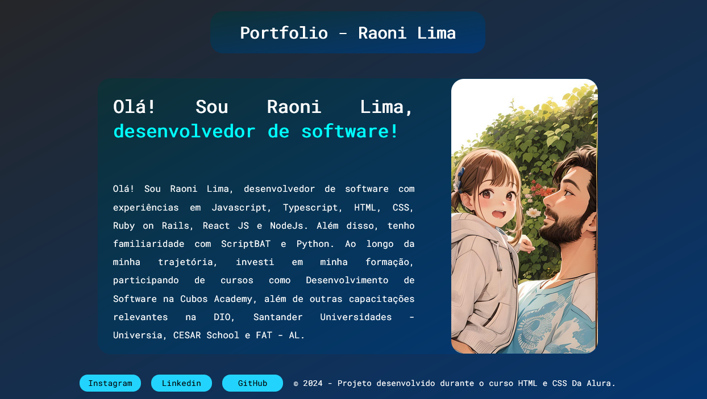

# Portfolio - Raoni Lima

Este é o repositório do meu portfólio pessoal, onde compartilho informações sobre mim e minha experiência como desenvolvedor de software. Abaixo está uma análise do projeto para ajudar a criar um README para o GitHub.

## Estrutura do Projeto

- **HTML:** O conteúdo está estruturado em HTML e seguindo as melhores práticas, com tags semânticas para facilitar a compreensão e acessibilidade.

- **CSS:** O estilo está separado em um arquivo CSS externo localizado em `./src/css/style.css`, promovendo uma melhor organização e manutenção do código.

- **Fontes:** O projeto utiliza a fonte "Roboto Mono" do Google Fonts para uma aparência moderna e legível.

## Conteúdo

- **Cabeçalho (Header):** Apresenta o título "Portfolio - Raoni Lima" e é destacado com a tag `<h1>`.

- **Corpo (Main):** Contém uma seção de texto inicial destacando o desenvolvedor e suas habilidades. A imagem animada é exibida ao lado do texto, proporcionando uma apresentação visual.

- **Rodapé (Footer):** Inclui links para as redes sociais do desenvolvedor (Instagram, LinkedIn, GitHub) e uma nota de direitos autorais.

## Links Externos

- **Redes Sociais:**
  - [Instagram](https://www.instagram.com/raonircl/)
  - [LinkedIn](https://www.linkedin.com/in/raoni-cerqueira-027026211/)
  - [GitHub](https://github.com/raonircl)

## Imagem

## Direitos Autorais

- O rodapé inclui uma nota de direitos autorais indicando que o projeto foi desenvolvido durante o curso HTML e CSS da Alura em 2024.

## Como Contribuir

Sinta-se à vontade para contribuir ou fornecer feedback. Basta seguir estas etapas:

1. Faça um fork do repositório.
2. Clone o repositório forkado para o seu ambiente local.
3. Faça as alterações desejadas.
4. Envie um pull request.

## Agradecimentos

- Agradeço à Alura pelo curso de HTML e CSS que contribuiu para o desenvolvimento deste projeto.

---

© 2024 - Desenvolvido por Raoni Lima durante o curso HTML e CSS da Alura.